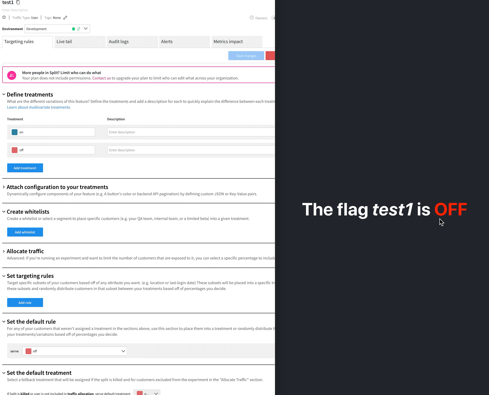

# splitio-react
> An alternative React solution for [Split.io](https://www.split.io/).


## How to Install

```
npm install split-react
```

or

```
yarn add split-react
```
## Motivation

Split is a great and simple solution to work with [Feature Flags](https://en.wikipedia.org/wiki/Feature_toggle), that can be used to control your application behavior, toggling features on and off, performing progressive rollouts ([canary launching](https://featureflags.io/canary-launch/)), A/B testing and so on. 

Besides proving SDKs for several programming languages, it also allows you to start with the free tier, in which you may control simple _string flags_ (or _splits_, as they call them).

Even though their [React SDK](https://help.split.io/hc/en-us/articles/360038825091-React-SDK) works well and brings many cool features out of the box, there's a possible improvement point, which is the very reason of this library here.

## The Problem

Whenever there's a change in one of your flags, their SDK triggers updating events to all of your hooked components listening to Split's flags, **even if they're not related to the flag that's just changed**. That will cause unnecessary re-renders in your React application, something to avoid, ideally.

## The Goal

Instead of working on their own repository, this library has the goals of not only improving that by avoiding unnecessary re-renders, as well as providing an even leaner solution that basically takes their basic [Javascript SDK](https://help.split.io/hc/en-us/articles/360020448791-JavaScript-SDK) and enhances it to be used on a React application.

## The Solution

What this library does is basically creating a `SplitProvider` to wrap your application with, using a simple [Pub/Sub](https://en.wikipedia.org/wiki/Publish%E2%80%93subscribe_pattern) mechanism under the hood, which will only dispatch update events to the hooks that are listening to the specific flags that have changed. Simple as that!

## Example

Here's a simple usage of `split-react`:
> [https://github.com/emarques3/test-split-react](https://github.com/emarques3/test-split-react)

There you'll find two basic usage of this lib, with `useSplit` [hook](https://reactjs.org/docs/hooks-intro.html), and `withSplit` [HOC](https://reactjs.org/docs/higher-order-components.html).

### Step by Step

1. Wrap your app with the `SplitProvider`
```tsx
import React from 'react';
import ReactDOM from 'react-dom';
import './index.css';
import App from './App';
import { SplitProvider } from 'split-react';
import { config } from './split/config';

ReactDOM.render(
  <SplitProvider config={config}>
    <App />
  </SplitProvider>,
  document.getElementById('root')
);
```
2. Use your Split config, the only required fields are the `authorizationKey` and `key`
```typescript
import { SplitConfig } from 'split-react';

const key = '[SOME_USER_KEY]';

export const config: SplitConfig = {
  core: {
    authorizationKey: '[YOUR_SPLIT_KEY]',
    key,
  },
};

```
3. In this example, `App.tsx` is calling this `Test.tsx`, just for the sake of separating the code

```tsx
import React from 'react';
import './App.css';
import { Test } from './components/Test';
// import TestHOC from './components/TestHOC';

function App() {
  return (
    <div className="App">
      <header className="App-header">
        <Test splitName="test1" />
        {/* <TestHOC /> */}
      </header>
    </div>
  );
}

export default App;
```

4. Call the `useSplit` hook to evaluate your flag

```tsx
import React from 'react';
import { useSplit } from 'split-react';

export const Test = ({ splitName }: { splitName: string }) => {
  const split = useSplit(splitName, false);
  const color = split ? '#00FF00' : '#FF0000'
  return (
    <h1>The flag <i>{splitName}</i> is <strong style={{ color }}>{split ? 'ON' : 'OFF'}</strong></h1>
  );
};
```

5. If you prefer, you may use the HOC instead of the Hook, as exemplified with `TestHOC` component. To do so, simply uncomment those lines above (on `App.tsx`) to start using it.

## See it in action 🎥


### There you go!

Now your React application will avoid unnecessary re-renders on components hooked with Split flags.